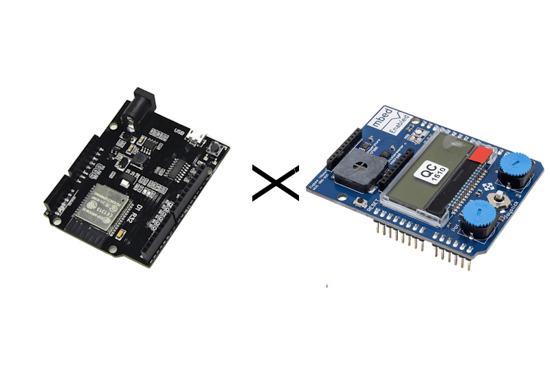
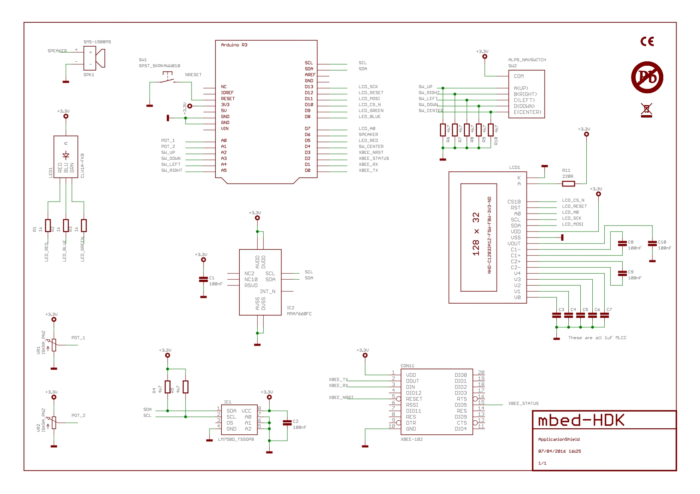
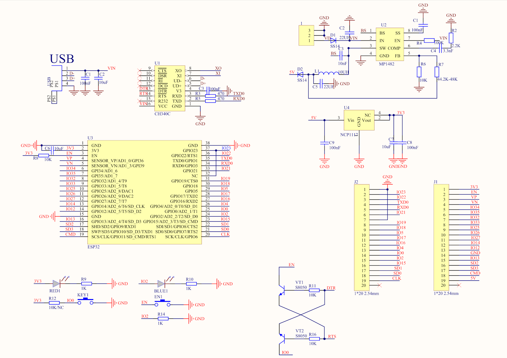

# UnoD1R32-ApplicationShield

## 🚀 Overview


**UNO-D1-R32-ApplicationShield** is an open-source firmware project based on **ESP-IDF**, designed to run on the **UNO D1 R32 Board Module** (ESP32) with the **ARMmbed Application Shield**. This project demonstrates the ESP32’s capabilities with practical examples using GPIO, ADC, PWM, I2C, SPI, and UART for embedded applications.

## 🎯 Purpose
- 🔌 **GPIO Control**: Read/write digital pins and generate PWM signals using LEDC.
- ⏱️ **Timer Management**: Use hardware/software timers to detect button presses.
- ⚡ **Interrupt Handling**: React to button or GPIO events using interrupts.
- 💬 **UART Communication**: Exchange data with a PC via UART for debugging or control.
- 🌡️ **Sensor Interaction**: Use I2C/SPI to read sensors and control external devices.
- 🔄 **ADC Utilization**: Read analog input values such as potentiometer voltage.

## 📝 Features

| Feature                | Description                                               |
|------------------------|-----------------------------------------------------------|
| 💡 GPIO + PWM          | Use `gpio` and `ledc` drivers for digital and PWM control.|
| ⏲️ Timer Support       | Use `esp_timer` or hardware timers for time-based events. |
| ⚠️ GPIO Interrupts     | Use `gpio_install_isr_service` for handling input events. |
| 💻 UART Communication  | Full duplex serial with `uart_driver_install()`.          |
| 🌡️ I2C Sensors         | Read LM75 temp sensor, MMA7660 accelerometer via I2C.     |
| 📺 SPI LCD             | Display sensor or system data using SPI LCD.              |
| 🎚️ ADC Readings       | Use `adc1_get_raw()` with calibration for accurate values. |

## 🔌 Application Shield Schematics


## 🧭 UNO D1 R32 Pinout


## 🎛️ Example Applications

### 1. LED Brightness via PWM
Control LED brightness using the ESP32 LEDC PWM module by adjusting duty cycle.

### 2. Joystick Input via GPIO
Read digital joystick states and map them to LED or system responses.

### 3. Potentiometer Reading via ADC
Read analog voltage from a potentiometer and convert it to a control parameter (e.g., LED brightness).

### 4. Sound Output via PWM
Generate sound tones via a piezo speaker by varying PWM frequency.

### 5. UART Communication
Exchange messages with a PC over UART for logging or receiving commands.

### 6. I2C Temperature Reading
Read ambient temperature from an LM75 sensor via the I2C protocol.

### 7. SPI LCD Display
Show system status, sensor values, or control messages on an SPI-connected LCD.

## 📁 Code Structure
```bash
uno-d1-r32-appshield/
├── main/
│ ├── main.c # Main firmware entry point
│ ├── gpio_ctrl.c # GPIO and PWM control logic
│ ├── adc_ctrl.c # Analog input handling
│ ├── timer_ctrl.c # Software/hardware timer handling
│ ├── uart_comm.c # UART interface
│ ├── i2c_ctrl.c # I2C communication
│ ├── spi_display.c # LCD SPI control
│ └── include/ # Header files
├── components/ # Optional external libs
├── assets/ # Images, config files, schematics
├── CMakeLists.txt
└── README.md
```

## 🌟 License
This project is open-source. You are free to use, modify, and contribute.
